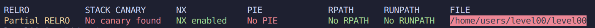

# Level 00

### Protections

(Explications des protections dans Ressources/learning)

### Analyse

(voir ./source.c)

Le programme contient uniquement une fonction `main()`.

* Celle-ci demande un mot de passe en entree a l'aide de `scanf()`. Avec l'option `%d`, `scanf()` converti notre entree en Int.
* Par la suite, une condition verifie si notre entree est egale a `0x149c`. Si c'est le cas, le programme ouvre un `/bin/sh` sinon il retourne 1.

Comme dans SnowCrash et Rainfall, les programmes possedent le bit SUID ce qui signifie qu'on l'execute avec les droits du proprietaire, en l'occurence `level01`.

### Exploitation

La conversion de `0x149c` nous donne **5276**.

Il nous suffit donc de donner ce nombre au programme est la comparaison sera *vraie*.

> level00@OverRide:~$ ./level00
> Password:5276
>
> Authenticated!
> $ whoami
> level01

Il nous suffit ensuite de faire un `cat` de `/home/users/level01/.pass` dans ce meme terminal.

> $ cat /home/users/level01/.pass
> uSq2ehEGT6c9S24zbshexZQBXUGrncxn5sD5QfGL

Notre flag est donc **uSq2ehEGT6c9S24zbshexZQBXUGrncxn5sD5QfGL**

*Rien de fou ici, c'est peut-etre histoire de se remettre dans le bain.*
